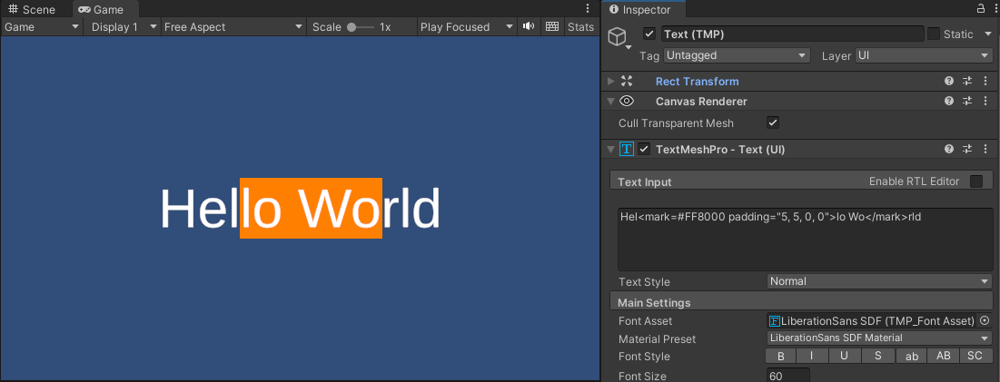

# TextMeshPro Modified

> What is this?

让 TextMesh Pro 富文本 Mark 标签生成的颜色置于文本后方，而不是覆盖在文本之上。

Place the color generated by the TextMesh Pro rich text Mark tag behind the text, rather than overlaying it on top of the text.

> Reference

https://forum.unity.com/threads/how-to-set-text-background-color.570751/#post-9538573
